# Godot基础教程01：实例-控制大炮

本节将讲解如何做一个简单的实例：

- 用方向键左右控制大炮左右移动
- 用方向键上下控制大炮炮口方向
- 用空格键发射炮弹

大概就是这个效果：
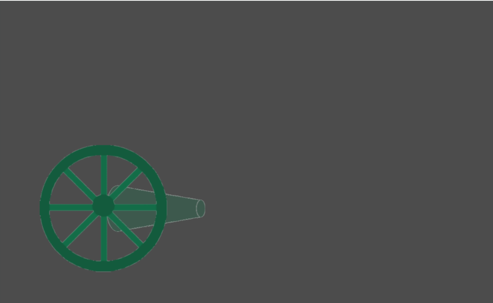


## 素材准备
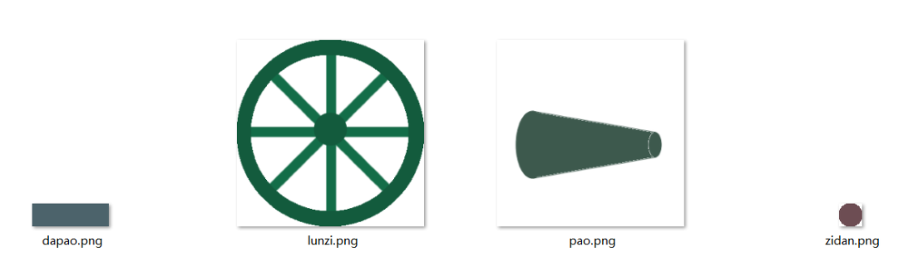

我自己用ps抠图，把图片抠出来，放到resources文件夹中：
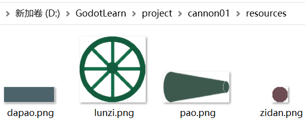

分别是大炮的架子，用方块代替一下，炮管和炮弹。

## 场景布置

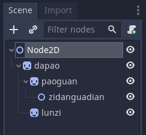

> 说明
Node2D : 根节点，Node2D类型
----dapao : 大炮节点，Sprite类型，加载资源dapao.png
--------paoguan : 炮管，Sprite类型，加载资源pao.png
------------zidanguadian : 子弹挂点，Node2D类型
--------lunzi : 轮子，Sprite类型，加载资源lunzi.png

保存这个场景，名为main.tscn
先保存了，然后可以一边修改，一边运行看效果。
main.tscn中只把我们的大炮放置好，让炮管可以在一定角度内旋转。

开始进行设置：
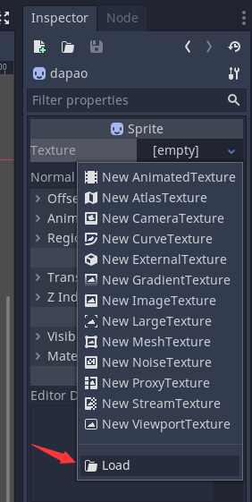
添加本地图片资源，一一添加完毕后，会看到：
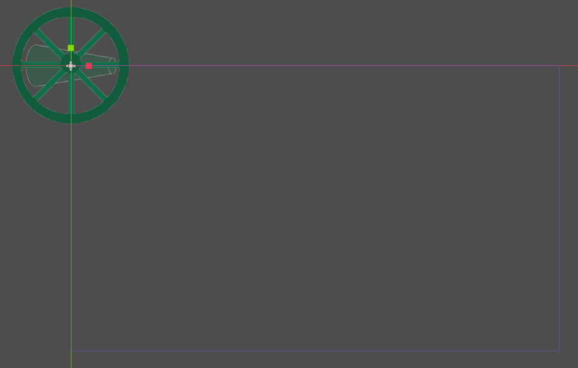

我们将炮进行整体移动：
选中dapao节点
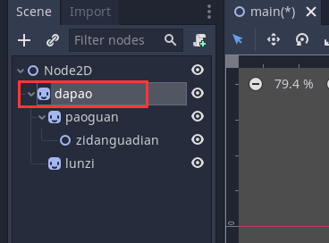

（备注：我们的屏幕分辨率设置的width: 1024, height: 600)
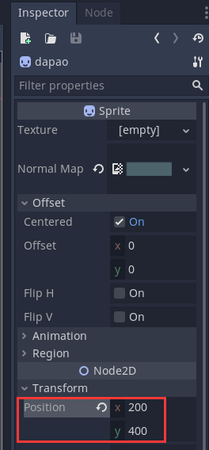

现在的大炮看起来是这样的：
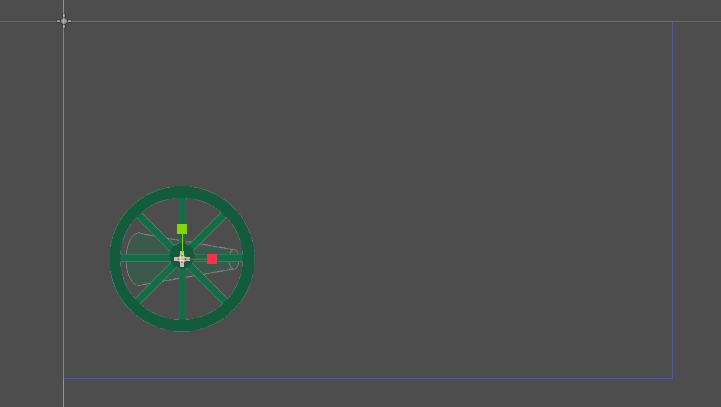

选中paoguang节点，在属性面板的Offset的x输入100
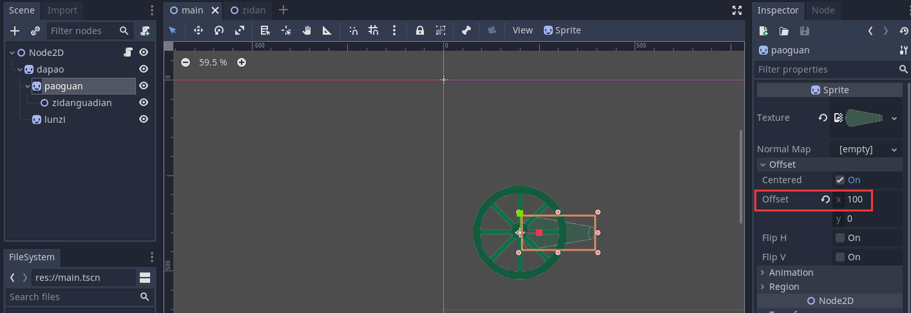

测试一下：
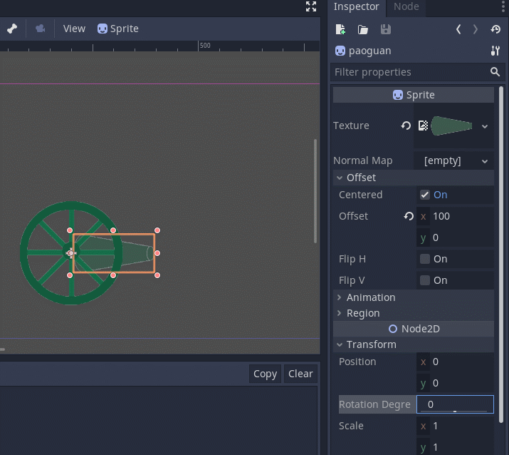

看到炮管能正常绕着炮台旋转，测试完毕后，将炮管的属性面板中的旋转角度(Rotation Degrees）设置为0

新建一个场景，增加子节点如下：
在Node2D节点下新建一个Sprite节点，并为其添加炮弹的图片资源，不要修改它的位置。

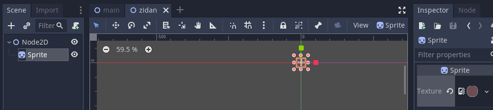
存为zidan.tscn

## 主场景添加脚本
这下重头戏来了，我们先在main.tscn场景中，为根节点添加一个脚本，名为`main.gd`，内容如下：
```c
extends Node2D

#定义变量时在前面加 export，表示可以在编辑器中直接修改
#大炮左右移动的速度 px/s
export var speed = 100

#炮管旋转速度 角度/s
export var rotation_speed = 60

#发射CD s
export var cd = 0.3

#炮管最高仰角
export var max_rotation = 60

#炮管最低仰角
export var min_rotation = 0

#加载zidan场景，并存到zidan变量中
var zidan = preload("res://zidan.tscn")

#为当前的cd计时
var cd_timer = 0

#每秒轮子需要转多少度
var r

#初始化
func _ready():
	#计算每秒轮子需要转多少度
	#r放到这里计算而不是_process中，是因为这里计算结果不会改变
	#如果放到_process中，就会每帧计算重复的内容，影响运行效率
	r = speed / (150 * PI) * 360

#每帧运行
func _process(delta):
	# 定义变量move，当按下左键或右键时，分别为move赋不同的值
	var move = 0
	if Input.is_action_pressed("ui_right"):
		move += 1
	if Input.is_action_pressed("ui_left"):
		move -= 1
	#这里使用 move+=1 、 move-=1，而不是 move=1 、 move=-1
	#这是因为前者在同时按下左右键时，move的最终结果为0，而后者的move最终结果为-1
	
	# 如果move不为0，说明按下了左或右键
	if move != 0:
		#使用 $节点名称 来调用节点，$节点名称/节点名称 来调用多层子节点
		#position是位置属性，rotation_degrees是以角度为单位的旋转，rotation是以弧度为单位的旋转
		#delta是_process方法的参数，表示本帧距离上一帧间隔的时间，单位是秒
		#速度乘以delta，可以确保在不同的帧率下，物体的移动速度相同
		$dapao.position.x += speed * move * delta
		$dapao/lunzi.rotation_degrees += r * move * delta
	
	#当按下上键或下键时，改变炮管的方向
	if Input.is_action_pressed("ui_up"):
		$dapao/paoguan.rotation_degrees -= rotation_speed * delta
		#限制仰角最大值，这里为什么要用负数呢，因为负数是逆时针，和我们在游戏里要的效果相反
		if $dapao/paoguan.rotation_degrees < -max_rotation:
			$dapao/paoguan.rotation_degrees = -max_rotation
	if Input.is_action_pressed("ui_down"):
		$dapao/paoguan.rotation_degrees += rotation_speed * delta
		if $dapao/paoguan.rotation_degrees > min_rotation:
			$dapao/paoguan.rotation_degrees = min_rotation
	
	#记录cd时间
	cd_timer -= delta
	
	#当按下空格键时，发射子弹
	if Input.is_action_pressed("ui_select") and cd_timer < 0:
		#实例化一个zidan场景对象
		var zidanObj = zidan.instance()
		#设置这个子弹的位置，global_position为全局位置
		zidanObj.position = $dapao/paoguan/zidanguadian.global_position
		#使子弹的角度与炮管的当前角度相同
		zidanObj.rotation_degrees = $dapao/paoguan.rotation_degrees
		#把子弹添加进场景
		add_child(zidanObj)
		#设置cd时间
		cd_timer = cd

```

选中子弹挂点（后面发射子弹时，就是从这个点发射）,将其Offset中的x设置为190，让其在炮管的出口位置：
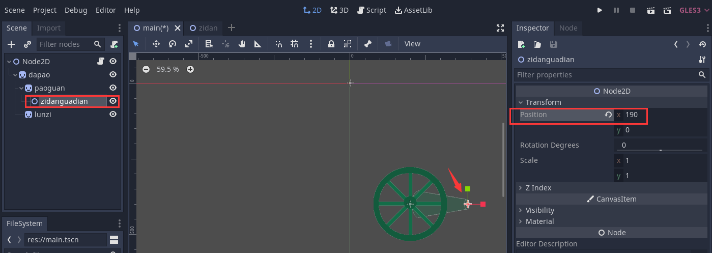

## 炮弹场景脚本
```c
extends Node2D

#炮弹速度
export var speed = 500

func _process(delta):
	#炮弹向右飞
	#因为在本场景被添加进主场景时，会将本场景的根节点角度设置为炮管的角度
	#所以本场景的Sprite只需要改变x坐标，也能实现向不同角度发射的目的
	$Sprite.position.x += speed * delta
	
	#当发射出去1000px远时，删除自身以释放资源
	if $Sprite.position.x > 1000:
		self.get_parent().remove_child(self)
```
编译运行：

全部代码已经放到github，地址：
[https://github.com/xiaozia/GodotLearn.git](https://github.com/xiaozia/GodotLearn.git)，本例子的全部工程代码在project/cannon01中

说明：我照着原文地址做了2遍，对一些参数的设置进行了重新截图，与原文描述略有不同。

原文地址：
[Godot基础教程04：实例-控制大炮](https://blog.csdn.net/shalyun/article/details/104793025)