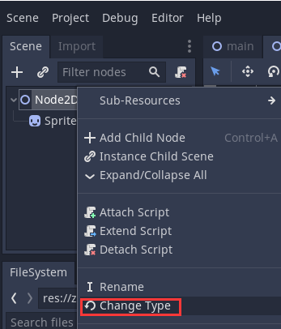
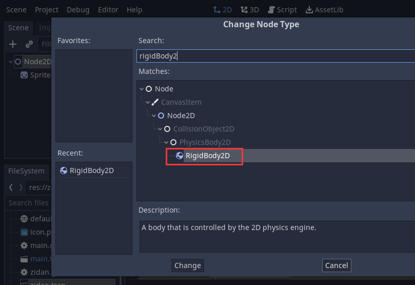
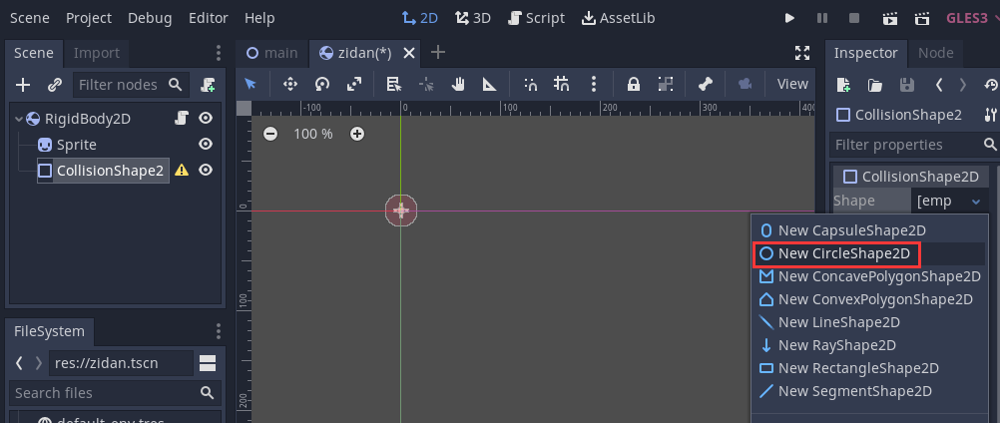
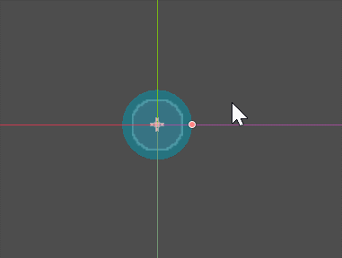
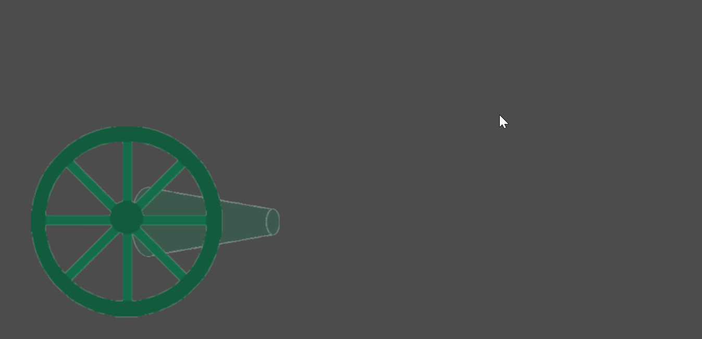

# Godot基础教程02：刚体炮弹


## 2D物理体概述

在godot中，2D物理体类为`PhysicsBody2D`，它是所有2d物理体的基类，不能添加到节点列表中。
它的3个派生类都可以添加到节点列表中，它们分别是：`KinematicBody2D`、`RigidBody2D`、`StaticBody2D`

- `StaticBody2D`：静态物理体，这种物理体将会静止不动，可以用作地面、墙壁这些不受重力影响、碰撞时也不会移动的物体
- `RigidBody2D`：刚体，只需要设置重力、质量等，它就会自动运动
- `KinematicBody2D`：动态物理体，这种物理体适合在代码中控制其移动，当前方发生碰撞时，将会停止移动
因为这些类都继承自CollisionObject2D（碰撞对象）类，所以它们都会相互碰撞。

## 实例修改

首先，我们要修改的是zidan场景，打开这个场景：
将根节点由原来的`Node2D`类型换成了`RigidBody2D`类型，并且在Sprite的同级增加了`CollisionShape2D`节点。
选中`CollisionShape2D`节点，在右侧属性面板中，形状右侧点击小箭头，选择新建`CircleShape2D`：

操作图所示：






新建成功后，选中CollisionShape2D节点，在场景中就会出现蓝色小圈和红色控制手柄，直接拖放就可以调整大小，将它调整到和炮弹一样大：


接下来将zidan.gd脚本文件的内容修改为：
```c
extends RigidBody2D

func _process(delta):
	
	#当超出屏幕时，删除自身以释放资源
	if self.position.y > 1000:
		self.get_parent().remove_child(self)
```

可以看到，少了很多代码，只剩下删除自身的部分
接下来，打开`main.gd`脚本，找到如下部分（上一节中是75行）：

```c
#使子弹的角度与炮管的当前角度相同
zidanObj.rotation_degrees = $dapao/paoguan.rotation_degrees
```

将这段代码修改一下：
```c
#--旧代码--#使子弹的角度与炮管的当前角度相同
#--旧代码--zidanObj.rotation_degrees = $dapao/paoguan.rotation_degrees
#--新代码--设置初始线速度
zidanObj.linear_velocity = ($dapao/paoguan/zidanguadian.global_position - $dapao/paoguan.global_position) * 2
```

下面来对上述改动解释一下：

首先是子弹场景，修改成了刚体节点，刚体会受到重力的影响自动往下方掉落。
只需要向炮弹设置初始线速度，相当于是将炮弹“发射”出去的力，这个速度是一个向量，所以用子弹挂点的全局坐标减去炮管的位置，就得到了这个向量。
但是这个向量实际测试时，炮弹发射的距离很近，所以在后面×2，使初始速度更大（如果还嫌射得近可以改成×3或更大的数值）

如果想要炮弹自动下落得更加明显，可以修改其重力加速度。

选中根节点RigidBody2D节点，在属性面板中看到RigidBody2D中的Gravity Scale，默认是1，设置为10试试。

会看到：


全部代码已经放到github，地址：
[https://github.com/xiaozia/GodotLearn.git](https://github.com/xiaozia/GodotLearn.git)，本例子的全部工程代码在project/cannon02中

原文地址：
[Godot基础教程04：实例-控制大炮](https://blog.csdn.net/shalyun/article/details/104793025)