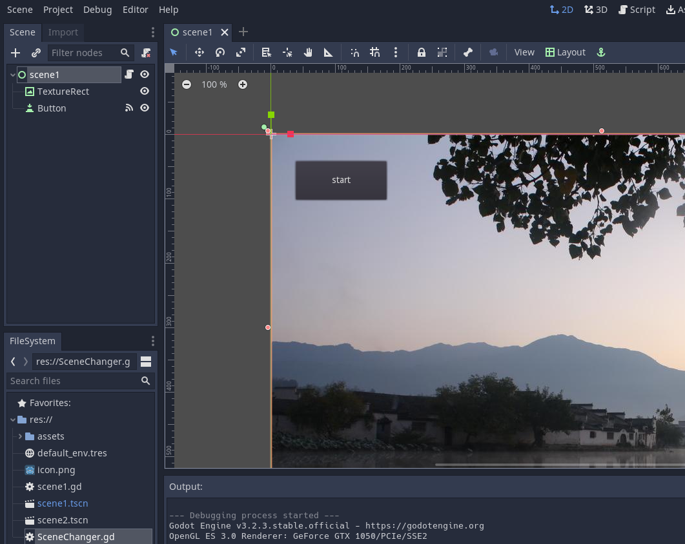
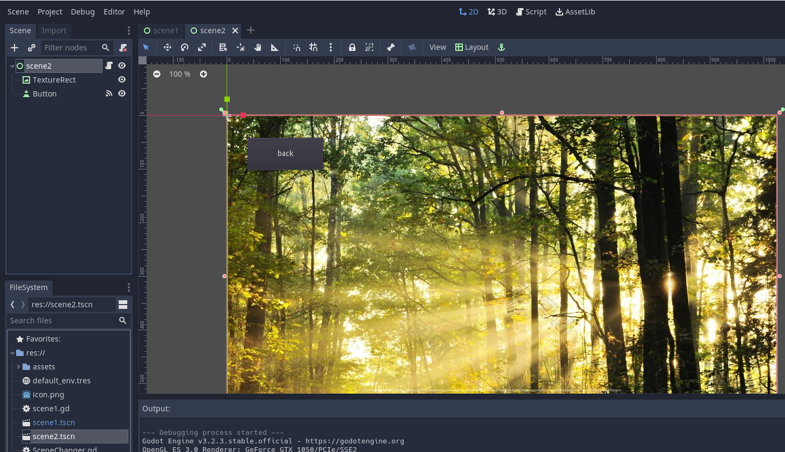
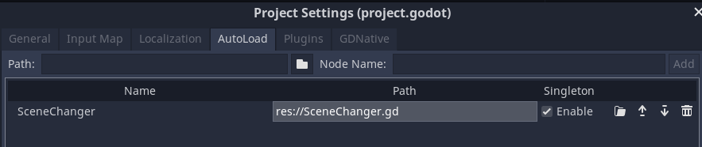
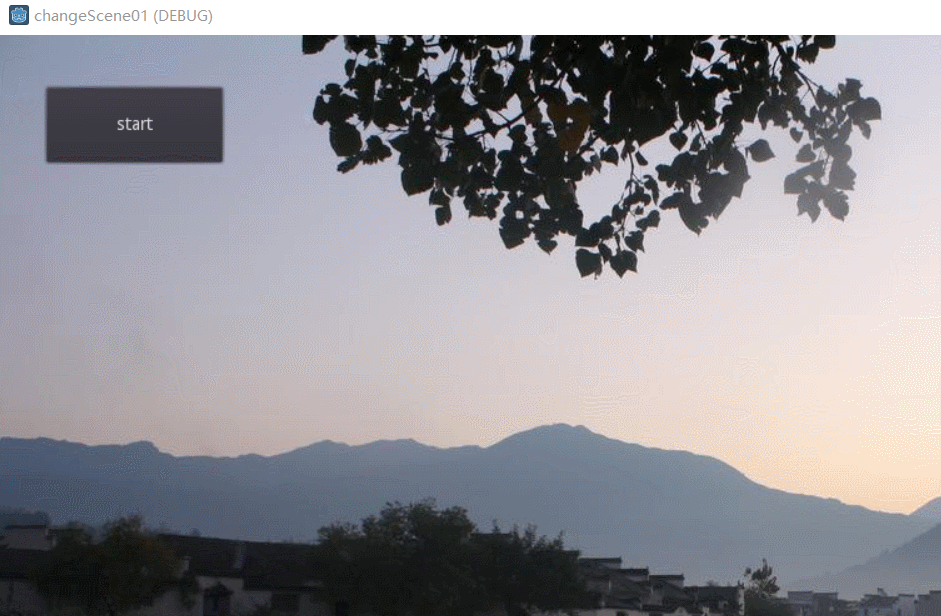

# 全局单例脚本切换场景

新建一个工程，如下图添加两个场景scene1和scene2
根节点都是control类型的，添加一个TextureRect控件，并且添加图片，作为背景图。（图片可以自己下载，设置为自己喜欢的）





两个场景共用一个脚本`scene1.jd`

```js
extends Control

func _on_Button_pressed():
	if self.name == "scene2":
		SceneChanger.change_scene("res://scene1.tscn")
	else:
		SceneChanger.change_scene("res://scene2.tscn")

```

添加一个脚本`SceneChanger.gd`:
```js
extends Node

var current_scene = null

func _ready():
	var root = get_tree().get_root()
	current_scene = root.get_child(root.get_child_count() - 1)
	
func change_scene(path):
	# This function will usually be called from a signal callback,
	# or some other function in the current scene.
	# Deleting the current scene at this point is
	# a bad idea, because it may still be executing code.
	# This will result in a crash or unexpected behavior.

	# The solution is to defer the load to a later time, when
	# we can be sure that no code from the current scene is running:
	
	#这个函数通常会从一个信号回调、
	#或当前场景中的其他函数中调用。此时删除当前场景不是一个好主意，
	#因为它可能仍在执行代码。这将导致崩溃或意外行为。
	#解决方案是将加载延迟到稍后的时间，此时我们可以确保当前场景中没有代码在运行
	call_deferred("_deferred_goto_scene", path)


func _deferred_goto_scene(path):
	# It is now safe to remove the current scene
	#现在可以安全地移除当前场景了
	current_scene.free()

	# Load the new scene.
	#加载新场景。
	var s = ResourceLoader.load(path)

	# Instance the new scene.
	#实例化新场景。
	current_scene = s.instance()

	# Add it to the active scene, as child of root.
	#将它添加到活动场景中，作为根的子级。
	get_tree().get_root().add_child(current_scene)

	# Optionally, to make it compatible with the SceneTree.change_scene() API.
	#（可选）使其与SceneTree.change_scene（）API兼容。
	get_tree().set_current_scene(current_scene)
```

将SceneChanger.jd设置为全局单例：



运行：


参考：
[单例（自动加载）](https://docs.godotengine.org/zh_CN/latest/getting_started/step_by_step/singletons_autoload.html#doc-singletons-autoload)
[自定义场景切换器](https://blog.csdn.net/qq_33017727/article/details/108419522)
[【Godot】全局脚本singleton和简单场景跳转](https://www.bilibili.com/video/BV1Gt411778q?t=167)
[godot Thread-safe APIs](https://docs.godotengine.org/zh_CN/latest/tutorials/threads/thread_safe_apis.html#scene-tree)
[godot 场景树](https://docs.godotengine.org/zh_CN/latest/getting_started/step_by_step/scene_tree.html)
[Godot Engine：用call_deferred线程安全地调用一个方法](https://blog.csdn.net/ttm2d/article/details/105295962)