godot新建一个空工程


根节点重命名为scene1

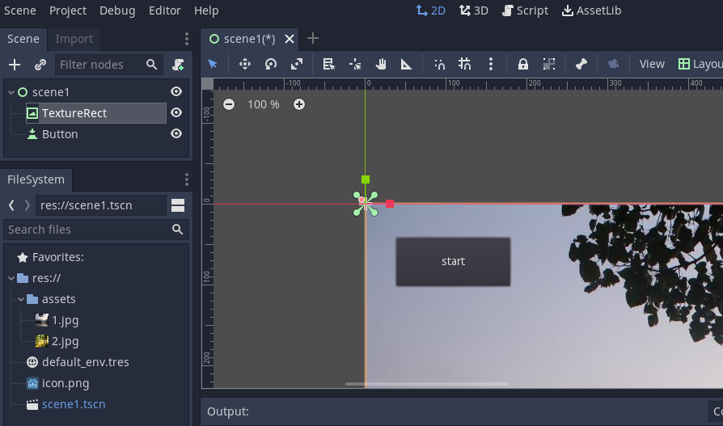

然后添加一个TextureRect节点，添加一张背景图1.jpg（网上下载的，你也可以替换成自己喜欢的背景图）
再添加一个Button控件，里面的文字输入“start”，按钮放置在右上角。
保存场景scene1

给场景添加一个gd脚本：
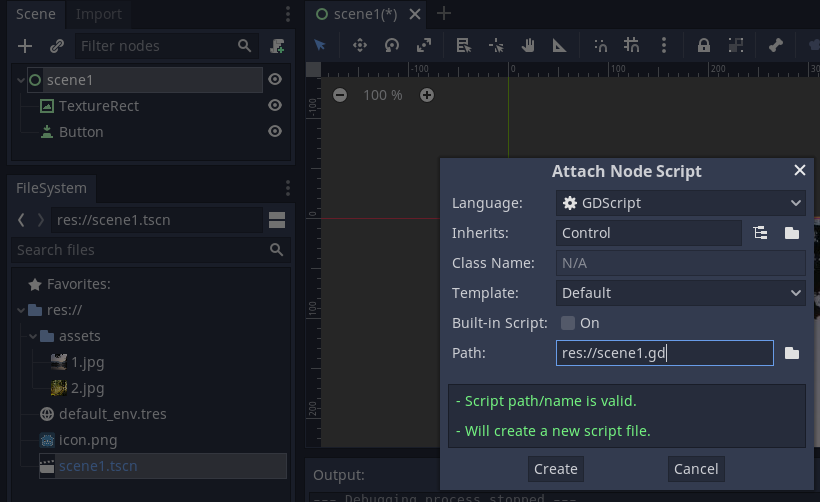

然后给按钮添加一个pressed的点击函数：
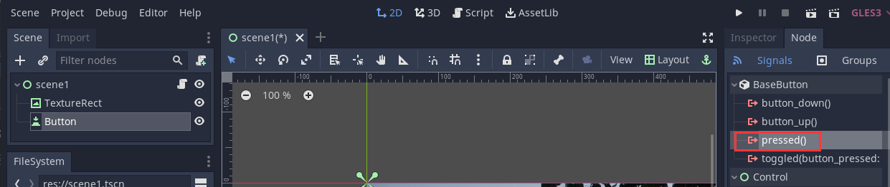

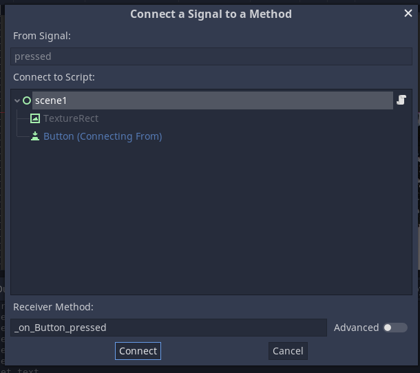

将场景scene1.tscn复制一份，改为scene2.tscn，替换scene2的背景图片为1.jpg，这样你就有了2个场景，接下来我们要做的就是在这两个场景之间进行切换。

复制场景的操作：
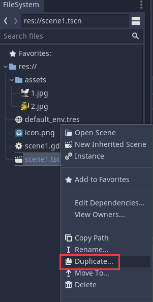

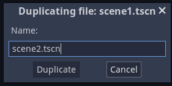

点击Duplicate
打开场景scene2，将根节点手动改名为scene2，按钮上的文字改成“back”
如图所示：
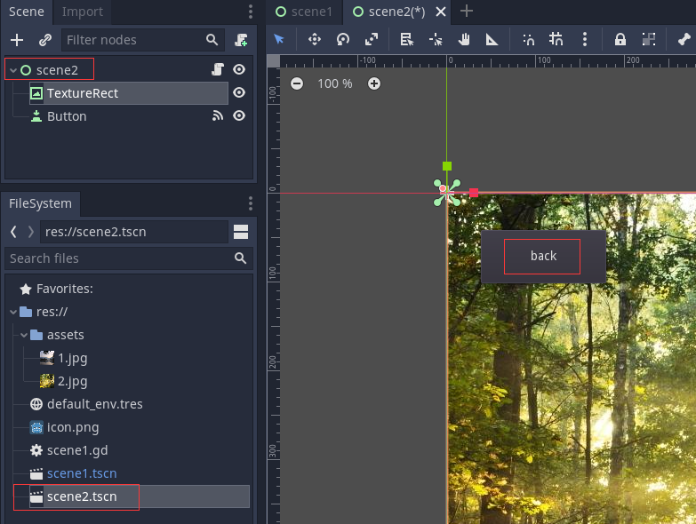

打开脚本scene1.gd（可以看到，复制后的场景，其实是共用一个脚本scene1.gd)
```js
extends Control

func _on_Button_pressed():
	if self.name == "scene1":
		get_tree().change_scene("res://scene2.tscn")
	else:
		get_tree().change_scene("res://scene1.tscn")

```
保存，选择scene1.tscn为初始场景，运行。
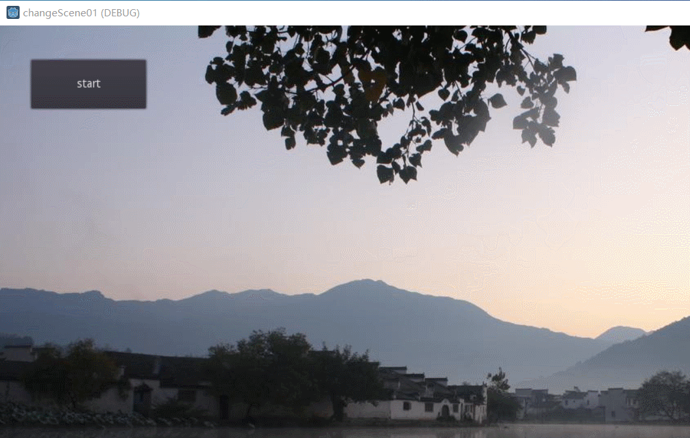

从场景一切换到了场景2，再点击按钮，场景2又切换回了场景1，但是没有过渡动画效果，接下来我们在场景切换过程中加入淡入和淡出动画，让场景切换更加平滑。

颜色选择0c0c0c（或者其他接近黑色的颜色值）
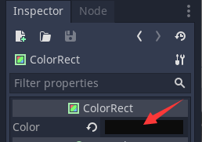

添加一个AnimationPlayer节点，添加一个scenechange动画，时长为0.5秒，单次动画。
选中ColorRect，在其属性面板里：
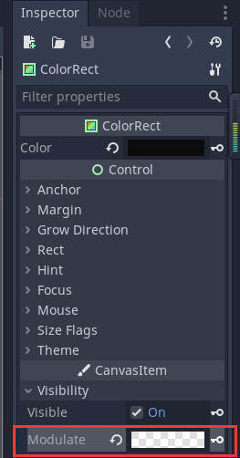

在0秒添加第一个关键帧：将透明度调成0，点击该属性值旁边的“钥匙”，添加关键帧
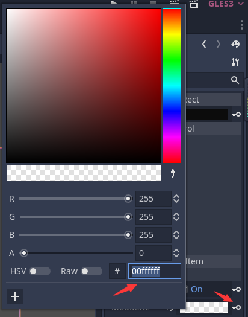
在第0.5秒添加第二个关键帧：
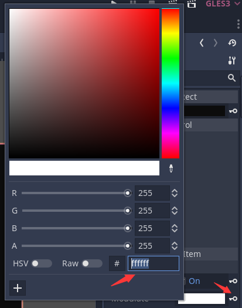

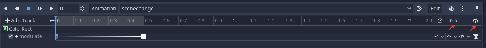

给SceneChanger添加一个脚本`SceneChanger.gd`

```js
extends CanvasLayer

onready var animator = $AnimationPlayer
onready var color = $ColorRect

func change_scene(path):
	color.show()
	animator.play("scenechange")
	yield(animator, "animation_finished")
	get_tree().change_scene(path)
	animator.play_backwards("scenechange")
	yield(animator, "animation_finished")
	color.hide()
```
让动画先正常播放，然后再倒放。

将ColorRect设置为不可见
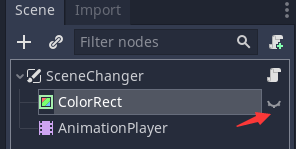

将SceneChanger.tscn设置为单例：
点击菜单：Project -> Project Settings -> AutoLoad
(不要忘记点击Add按钮，点击后看到如图所示，才算是添加成功)


`scene1.gd`脚本内容改成：
```js
extends Control

func _on_Button_pressed():
	if self.name == "scene2":
		SceneChanger.change_scene("res://scene1.tscn")
	else:
		SceneChanger.change_scene("res://scene2.tscn")

```
效果：


参考：
[B站视频教程：【Godot】实现场景的平滑过渡切换](https://www.bilibili.com/video/BV1W54y1Q7bJ?t=414)