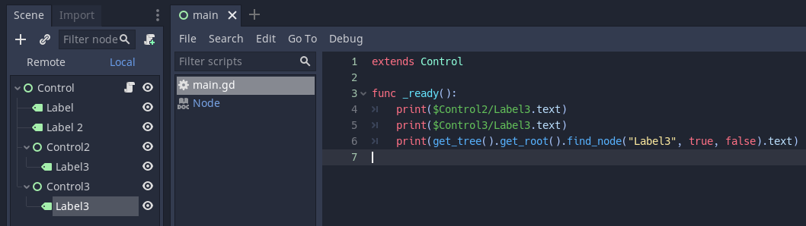
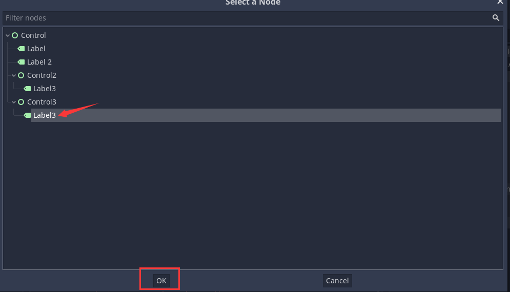
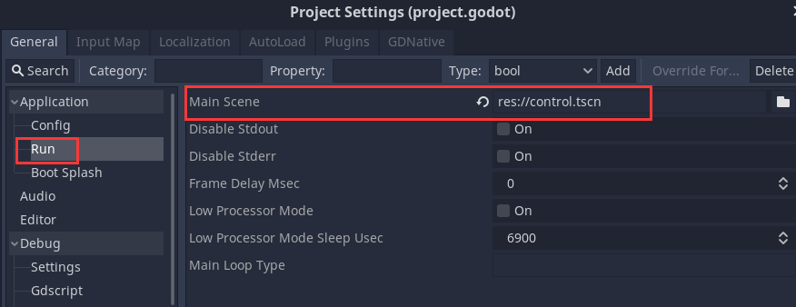
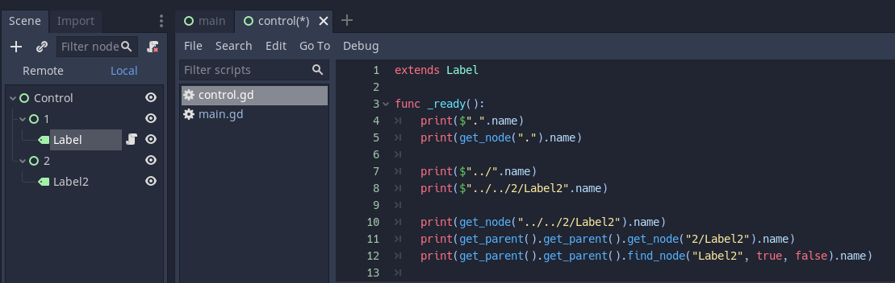
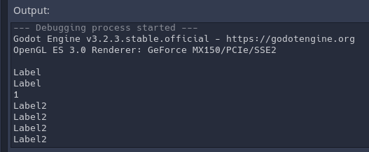

# 获取节点的方法与技巧(NodePath)

首先创建一个空的项目，节点如下图所示，给根节点挂在一个脚本，存为`main.tscn`：


```c
extends Control

# Called when the node enters the scene tree for the first time.
func _ready():
	print($Label)
	print(get_node("Label"))
	print($"Label 2")
	
	print($Control2/Label3)
	print(get_node("Control2/Label3"))
```

运行结果：


说明：
脚本所在的路径为当前节点，获取方式可以通过$，或者get_node，如果想用$获取带空格的节点名，则需要将其用双引号引起来。get_node中，都是用双引号引起来的。
看代码提示可以清晰理解这一点：


## 打印节点的名字
```c
extends Control

# Called when the node enters the scene tree for the first time.
func _ready():
	print($Label.name)
	print(get_node("Label").name)
	print($"Label 2".name)
	
	print($Control2/Label3.name)
	print(get_node("Control2/Label3").name)

```
运行结果：
```c
Label
Label
Label 2
Label3
Label3
```

## 将节点缓存到变量中
将`main.gd`改成：
```c
extends Control

onready var mylabel = $Label

# Called when the node enters the scene tree for the first time.
func _ready():
	print($Label.name)
	print(mylabel.name)
#	print(get_node("Label").name)
#	print($"Label 2".name)
#
#	print($Control2/Label3.name)
#	print(get_node("Control2/Label3").name)

```
运行结果：
```
Label
Label
```
当层级变动的时候，如何在不修改代码的情况下，正确获取到我们之前的节点呢？

## 利用find_node

此时我们的`main.gd`脚本改为：
```c
extends Control

func _ready():
	print($Control2/Label3)
	print(get_tree().get_root().find_node("Label3", true, false))
```
运行结果：
```c
[Label:1181]
[Label:1181]
```

讲解：
```c
Node find_node ( String mask, bool recursive=true, bool owned=true ) const
```

查找此节点的子节点，其名称与中的掩码匹配字符串。匹配（即区分大小写，但“*”匹配零个或多个字符，而“？”匹配除“.”以外的任何单个字符。

注意：它与完整路径不匹配，只与单个节点名称匹配。

如果owned为true，则此方法仅查找所有者为该节点的节点。这对于通过脚本实例化的场景尤其重要，因为这些场景没有所有者。

注意：由于此方法遍历节点的所有子代，因此获取对另一个节点的引用是最慢的方法。只要可能，请考虑改用get_node。为了避免过于频繁地使用find_node，请考虑将节点引用缓存到变量中。

```c
[Label:1181]
[Label:1181]
```

find_node如果有多个同名节点话，只会找到第一个。
节点改成如下：


control2下有个Label3，text设置为123
control3下有个Label3，text设置为456

`main.gd`如下：
```c
extends Control

func _ready():
	print($Control2/Label3.text)
	print($Control3/Label3.text)
	print(get_tree().get_root().find_node("Label3", true, false).text)
```
运行结果如下：
```c
123
456
123
```

# 利用导出变量，在属性面板绑定节点
`main.gd`：
```c
extends Control

export var labelPath : NodePath

func _ready():
	print($Control2/Label3.text)
	print($Control3/Label3.text)
	print(get_tree().get_root().find_node("Label3", true, false).text)
	print(get_node(labelPath).text)
```


绑定control3下的label3



运行结果：
```c
123
456
123
456
```

## 获取兄弟节点
新建一个场景Label.gd


设为主场景，启动时第一个加载：


节点图如下：


control.gd：
```c
extends Label

func _ready():
	print($".".name)
	print(get_node(".").name)
	
	print($"../".name)
	print($"../../2/Label2".name)
	
	print(get_node("../../2/Label2").name)
	print(get_parent().get_parent().get_node("2/Label2").name)
	print(get_parent().get_parent().find_node("Label2", true, false).name)
```
节点是个树形结构，可以用相对路径的方式去获取。

运行结果：

参考：
[Godot】获取节点的方法与技巧(NodePath)](https://www.bilibili.com/video/av669414354/)