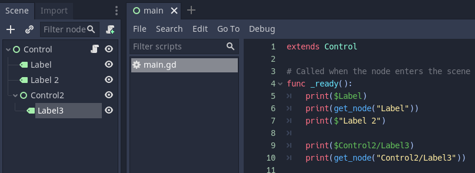
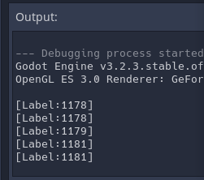
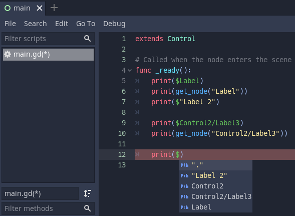
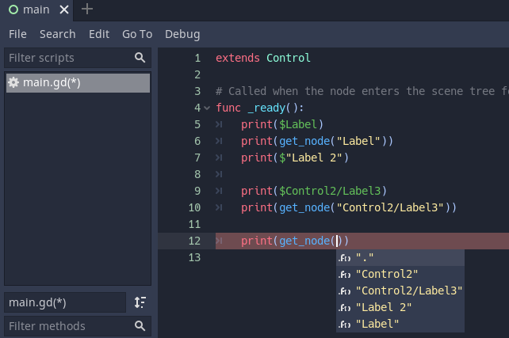

# 获取节点的方法与技巧(NodePath)

首先创建一个空的项目，节点如下图所示，给根节点挂在一个脚本，存为`main.tscn`：


```c
extends Control

# Called when the node enters the scene tree for the first time.
func _ready():
	print($Label)
	print(get_node("Label"))
	print($"Label 2")
	
	print($Control2/Label3)
	print(get_node("Control2/Label3"))
```

运行结果：


说明：
脚本所在的路径为当前节点，获取方式可以通过$，或者get_node，如果想用$获取带空格的节点名，则需要将其用双引号引起来。get_node中，都是用双引号引起来的。
看代码提示可以清晰理解这一点：




参考：
[Godot】获取节点的方法与技巧(NodePath)](https://www.bilibili.com/video/av669414354/)